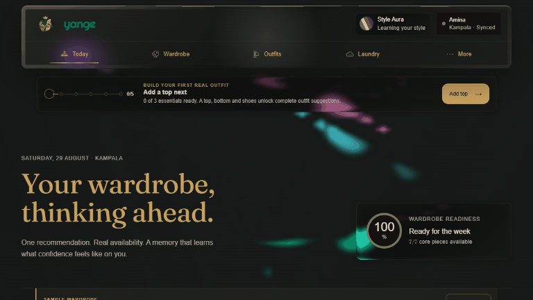
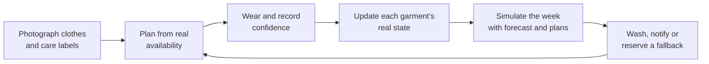
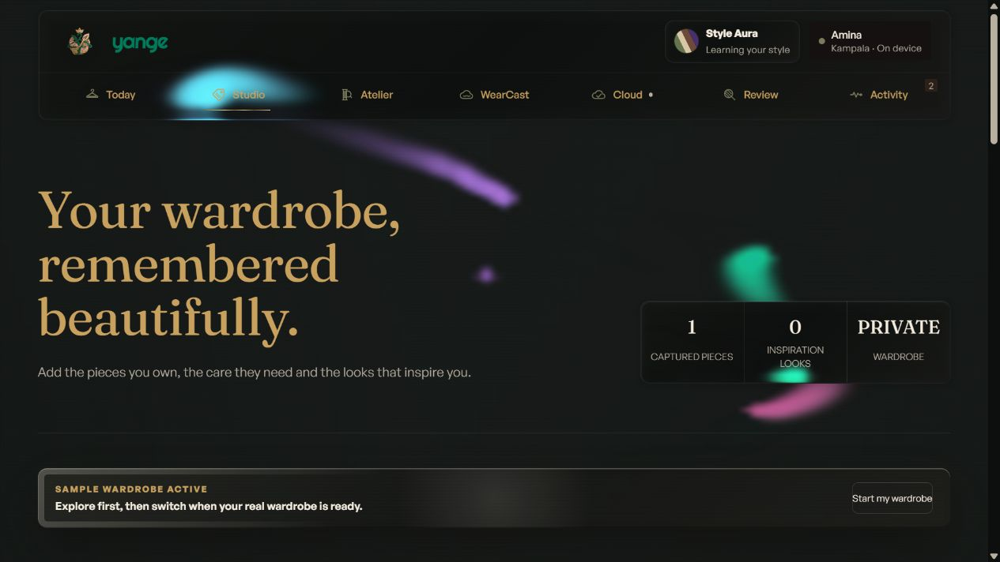
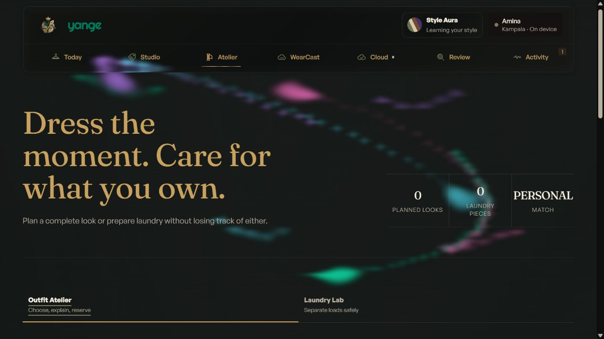
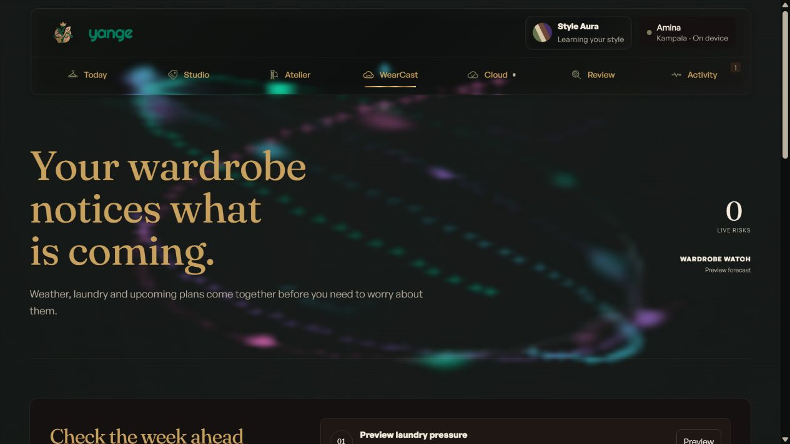

# Yange

**Some mornings I lost 30 minutes to my own closet. Yange ended that.**

Yange is a personal wardrobe agent that turns the clothes you already own into weather-ready outfits, learns from how you felt wearing them, and acts before laundry disrupts your plans.

**[Open the live product](https://yange-kdxt2klboq-bq.a.run.app/)** · **[See the architecture](#architecture-built-to-survive-failure)** · **[Run it locally](#run-yange)**

[](https://yange-kdxt2klboq-bq.a.run.app/)

<sub>Live capture from the deployed product: one worn outfit updates five garment states, records a Confidence Check-in and changes the Aura from learning to a personal palette.</sub>

## I built the agent I needed

I am **Musoke Nestroy**, and some mornings I could spend as much as 30 minutes standing in front of my wardrobe trying to decide what to wear.

The problem was not a lack of clothes. It was the number of facts I was trying to hold in my head at once: what I had worn recently, what still needed washing, which pieces I was overusing, what the weather in Kampala might do next, where I was going, and whether an outfit would actually feel like me. I would reach for the same familiar pieces while other clothes stayed idle, shortening the life of the clothes I loved most.

Laundry created a second version of the same problem. I had to reread care labels, separate materials safely, guess whether the weather would let them dry, and remember whether a planned outfit depended on something sitting in the laundry basket.

That confusion is not mine alone. A [2017 survey of 500 people in the UK](https://www.laundryandcleaningnews.com/news/over-half-of-people-find-clothing-care-labels-confusing-5768936/) found that 56% found clothing-care symbols confusing. More locally, a [2023 study of 159 Family and Consumer Sciences students in Ghana](https://www.scipublications.com/journal/index.php/jad/article/view/703) found that 42.1% did not understand care-label information; most students could not identify several common drying and bleaching symbols. Yange reads the label once, asks when the evidence is uncertain, and remembers the confirmed instructions for the garment's lifetime.

I realised this was not simply an outfit-recommendation problem. It was a **memory, state, and forward-planning problem**.

That experience became Yange. In Luganda, *yange* means **mine**. The name is the product promise: my wardrobe, my evidence, my preferences, and an agent that learns my routines instead of issuing generic rules about what should look good on me.

| Before Yange | With Yange |
| --- | --- |
| Search the whole wardrobe from memory | Rank only outfits that are actually available |
| Rewear the same pieces without noticing | Track wear, airing, rewear and laundry state per garment |
| Read every care label again on wash day | Build safe wash groups from confirmed care evidence |
| Wash when the forecast cannot support drying | Find the strongest forecast-backed laundry opportunity |
| Discover too late that Friday's blouse is dirty | Detect the dependency early, notify me, and reserve a fallback |
| Receive generic styling advice | Learn from my own confidence feedback and chosen colours |

## One Friday explains the whole product

1. **Capture reality.** Photograph a garment and its care label. Yange extracts observable evidence, then asks the user to confirm uncertain material and care facts.
2. **Ask naturally.** Request an outfit for Friday dinner, optionally with a Pinterest image or a saved frame from a social video as inspiration.
3. **Plan from what exists.** Yange rejects unavailable pieces, scores feasible combinations against weather, occasion, comfort, care practicality and learned preferences, then reserves the selected garments.
4. **Learn from lived feedback.** After the outfit is worn, a simple Confidence Check-in records how the user felt. Colour-specific feedback is stronger than a broad outfit rating, so the system does not pretend to know which detail caused confidence.
5. **Think ahead.** Marking the outfit worn moves different garments into rewearable, airing or laundry states according to their material and care evidence.
6. **Act before the problem arrives.** If Friday's plan now depends on a dirty garment, Yange checks the forecast, identifies a safe washing opportunity, groups compatible laundry, sends a risk notification and reserves a verified alternative when needed.



This is the core loop. The user does not have to keep reopening a chat and asking whether something has changed. Yange can notice the risk, complete the safe parts of the workflow asynchronously, and surface what it did with an inspectable receipt.

## Why Yange is more than an outfit chatbot

### 1. A wardrobe that knows its own state

Yange reconstructs a live wardrobe projection from an append-only event ledger. Wearing an outfit does not mark every item “dirty.” A cotton blouse can move to laundry, trousers to rewearable, a jacket to airing, and shoes remain available. This matters because the next recommendation is grounded in reality rather than a static photo catalogue.

### 2. Recommendations that cannot invent clothes

The outfit engine first applies hard constraints, then calculates a deterministic five-factor **Personal Match** receipt. Gemini explains the completed result in natural language, but it cannot select garments, replace the score, emit state-changing actions or override availability.

### 3. Laundry treated as an operational workflow

Yange calls its future-risk loop **WearCast**. Confirmed care-label evidence becomes an incompatibility graph. Yange separates unsafe combinations, isolates unknown-care garments instead of guessing, assigns drying routes, and uses a seven-day forecast to compare doing nothing with acting now. At 50% core-wardrobe pressure, it can warn the user before choice collapses.

### 4. Personalisation without body judgement

Height, fit, comfort and colour preferences are user-controlled inputs, not attractiveness verdicts. Confidence feedback becomes contextual memory. Positive and negative colour evidence is attributed carefully, decays with time, and remains explainable through counts such as “three confident wears” or “two saved looks.”

### 5. Multimodal evidence with a human checkpoint

Gemini 3.5 Flash Lite reads garment photos, care labels and inspiration images into versioned JSON contracts. Images are signature-checked, resized and metadata-stripped before storage. Uncertain facts remain uncertain until the user confirms them; malformed model output is rejected rather than written into wardrobe state.

### 6. A safer virtual preview, downstream of the decision

**Yange Mirror** can preview one photographed top or outerwear piece after an outfit is already selected. Google Virtual Try-On runs as an isolated asynchronous job with adult-only consent, private temporary media, one result, a four-per-day cap and immediate deletion controls. A failed preview cannot change the outfit, score, learned colour projection or wardrobe ledger. Every result is labelled **AI visualization, not a fit guarantee**.

## The interface learns too

I wanted Yange to feel less like static software and more like a companion that visibly earns familiarity.

The WebGL **Style Aura** begins with colours the user explicitly chooses. Confirmed inspiration palettes, wardrobe colours and confidence feedback add weighted evidence over time. The displayed palette moves no more than 8% after one new evidence signature, so a single interaction cannot abruptly rewrite the product's personality. The user can open the receipt behind the Aura and see which evidence moved each colour.

The visual layer remains expendable. If WebGL fails, the Aura becomes a still composition while every wardrobe action continues to work. Reduced-motion mode freezes it deliberately, hidden tabs pause rendering, and sustained frame pressure lowers only the drawing resolution.

## Product journey

| Capture the wardrobe | Plan from evidence | Act on what is coming |
| --- | --- | --- |
|  |  |  |
| Garments, care labels and inspiration become reviewed evidence. | Only feasible outfits reach the Personal Match ranking. | Weather, laundry and future plans are simulated before action. |

## Architecture built to survive failure

Yange follows one rule throughout the system:

> **AI proposes. Validated domain rules commit.**

The domain engine has no React, browser, Gemini or Google Cloud dependency. External systems live behind replaceable ports, long-running work resumes from durable checkpoints, and every autonomous mutation is validated again at the worker boundary.


### Decision path

```text
Browser request
  -> public Cloud Run edge validates session and command
  -> Cloud Tasks sends an OIDC-authenticated job
  -> private Cloud Run worker rebuilds the wardrobe projection
  -> Google Weather and optional Calendar provide timestamped context
  -> deterministic domain policies simulate and validate the action
  -> one Firestore transaction writes event + projection + outbox
  -> Pub/Sub and notification delivery continue from checkpoints
```

### Google AI responsibilities

| Capability | Model or framework | Authority boundary |
| --- | --- | --- |
| Garment, care-label and inspiration evidence | Gemini 3.5 Flash Lite on Vertex AI | Produces schema-constrained proposals; the user confirms uncertain facts |
| Outfit explanation | Gemini 3.5 Flash on Vertex AI | Explains an already-computed score; cannot choose or mutate |
| Supervised reasoning agent | Google ADK with Gemini 3.5 Flash | Can inspect the wardrobe or request a verified WearCast run through two narrow tools |
| Optional garment preview | Google Virtual Try-On `virtual-try-on-001` | Produces one temporary image outside the wardrobe ledger |
| Outfit ranking, care safety, state transitions and commits | Pure TypeScript domain engine | Sole decision authority |

The two Gemini variants are intentional. Flash Lite handles frequent schema-constrained visual evidence extraction. Flash handles the higher-level explanation and supervised ADK reasoning paths. Both remain downstream of the deterministic rules that decide and commit wardrobe state.

### Failure is contained, not hidden

| Failure | What Yange does |
| --- | --- |
| Gemini returns malformed data | Rejects the contract and preserves the rewritten image for an explicit retry |
| Weather or Calendar is unavailable | Labels stale or manual context; unrelated wardrobe features remain usable |
| Notification delivery fails | Keeps the valid intervention, resumes from the delivery checkpoint and avoids duplicate messages |
| A scheduler or task delivers twice | Stable trigger and operation IDs return the existing receipt without repeating side effects |
| WebGL context is lost | Swaps to an accessible still while product controls stay mounted |
| Virtual Try-On is blocked or slow | Leaves the selected outfit and every wardrobe decision untouched |

The full rationale is documented in [docs/architecture.md](docs/architecture.md).

## Live proof

The public build is not a local model simulation. It is deployed on Google Cloud and activates the real Google adapters through the same versioned contracts used by the credential-free local mode.

| Proof | Current evidence |
| --- | --- |
| Public product | [yange-kdxt2klboq-bq.a.run.app](https://yange-kdxt2klboq-bq.a.run.app/) |
| Health endpoint | [`/health`](https://yange-kdxt2klboq-bq.a.run.app/health) returns `ok` |
| Runtime receipt | [`/v1/runtime`](https://yange-kdxt2klboq-bq.a.run.app/v1/runtime) reports Google mode, readiness and configured model boundaries |
| Dated deployment receipt | [Redacted live verification from 29 August 2026](docs/evidence/live-deployment-2026-08-29.md) |
| Public edge | Cloud Run revision `yange-00013-qzv`, 100% traffic on 29 August 2026 |
| Private worker | Cloud Run revision `yange-worker-00011-m54`, 100% traffic on 29 August 2026 |
| Async infrastructure | Cloud Tasks, Cloud Scheduler, Firestore transactional outbox, Pub/Sub ordered events and a dead-letter topic |
| Automated verification | 108 TypeScript tests, strict typechecking, production builds, Terraform validation and a high-severity dependency gate |
| CI | [](https://github.com/NestroyMusoke/Yange/actions/workflows/ci.yml) |

The Mirror feasibility experiment produced a 1237 × 1920 preview in roughly 32 seconds while preserving the subject's identity, pose, trousers, shoes and background. The experiment also exposed fabric smoothing and a lost wrist accessory, which is why the production interface avoids fit claims. Read the complete [safety and experiment record](docs/yange-mirror.md).

## Run Yange

### Requirements

- Node.js 22 or newer
- npm 10 or newer
- No credentials for the complete local rehearsal

### Local product

```powershell
git clone https://github.com/NestroyMusoke/Yange.git
cd Yange
npm.cmd install
npm.cmd run dev
```

Open the URL printed by Vite. Local mode uses deterministic adapters so contributors can reproduce the whole wardrobe loop without spending money or weakening the model boundaries.

### Production-shaped local edge

```powershell
npm.cmd run dev:cloud
```

Open `http://127.0.0.1:4173/`. This runs the built web application and API together while keeping external Google calls in safe local mode.

### Verify the repository

```powershell
npm.cmd test
npm.cmd run typecheck
npm.cmd run build
```

The full release gate is also available as:

```powershell
.\scripts\verify-phase6.ps1
```

### Deploy to Google Cloud

```powershell
.\scripts\deploy-google-cloud.ps1 -ProjectId YOUR_PROJECT_ID
```

The deployment script builds the role-separated edge and worker image plus the Google ADK service, provisions the required Google Cloud infrastructure with Terraform, and probes the resulting public URL. See [docs/google-cloud-setup.md](docs/google-cloud-setup.md) for authentication, IAM, budget safeguards, Calendar sharing and rollback.

## Repository map

| Path | Responsibility |
| --- | --- |
| `apps/web` | Responsive product, accessible fallbacks, local persistence and guided user journey |
| `apps/api` | Public edge, private worker routes, sessions, security headers and static delivery |
| `packages/domain` | Commands, events, projections, outfit scoring, laundry safety and WearCast policies |
| `packages/contracts` | Versioned model requests, responses and runtime validation |
| `packages/orchestrator` | Checkpointed execution, retry, resume and duplicate-trigger protection |
| `packages/cloud` | Firestore, Storage, Tasks, Pub/Sub, Weather, Calendar and Vertex AI adapters |
| `services/yange_steward` | Private Google ADK agent with two workload-identity tools |
| `infra/terraform` | Least-privilege service identities and production infrastructure |
| `docs` | Architecture, experiment records, demo runbook and deployment guide |

## Privacy and honest limits

- Yange does not decide what objectively “flatters” a body or skin tone. It learns user-controlled preferences and reports them as options.
- Original images are not stored in the event ledger. Events contain opaque asset IDs; private media is accessed with short-lived signed URLs.
- Care evidence that is missing or unreviewed fails closed and is excluded from a recommended wash group.
- The public deployment currently runs without Google Calendar connected. Weather-aware planning, manual occasion context and the rest of the agent remain available.
- Direct TikTok ingestion is not implemented. A user can upload a saved frame for inspiration analysis.
- Mirror currently supports one photographed top or outerwear piece for a consenting adult. It is not a size, comfort or fit estimator.
- Shopping gap analysis and local price discovery remain future work. The current product focuses on getting more value and longer life from clothes the user already owns.

## Built from experience, engineered for trust

Yange began with a small, repeated frustration in my own life. Building it changed the question from “Can AI choose an outfit?” to a more useful one:

> **Can an agent understand the state of what I own, learn how I actually feel, and quietly keep tomorrow's options open?**

That is the product I wanted beside me. Now it is live.

Built by **Musoke Nestroy** in Kampala, Uganda, for the All Things Agentic Hackathon.
