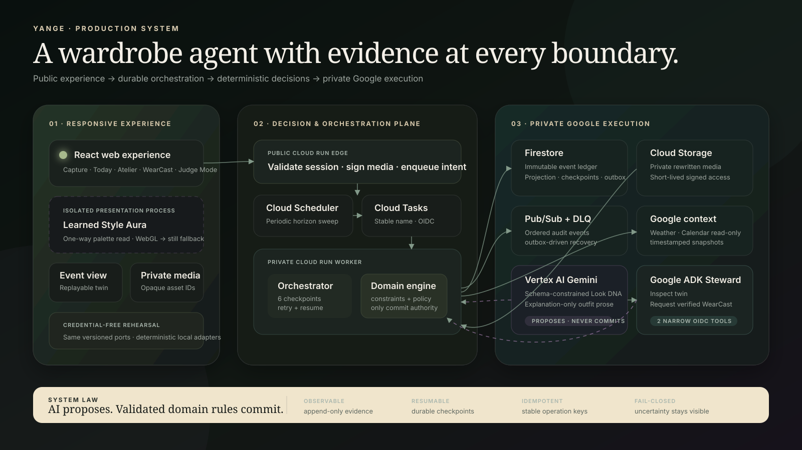

# Yange

Yange is the wardrobe agent that learns what confidence looks like on you. Its name draws from the Luganda possessive *yange*—“my”—because the experience is built around my wardrobe, my preferences, and my confidence. Yange maintains a live Wardrobe Digital Twin, plans with real garment availability, and turns wear history into safer laundry and more personal outfit decisions.

## Current build — release candidate

The complete product runs locally without credentials and activates its deployed Google adapters when served by the Cloud Run edge. The build now includes:

- A responsive mobile-first product shell
- An event-driven Wardrobe Digital Twin
- Material-aware post-wear garment transitions
- Wardrobe readiness calculation
- Confidence Check-ins and preference-memory updates
- A user-visible Agent Activity audit trail
- Local persistence through a replaceable repository adapter
- First-run profile and location setup with optional browser geolocation
- A reversible sample experience and a clean personal-wardrobe mode
- Garment editing and two-step archive safeguards
- Garment and optional care-label image capture
- On-device signature validation, resize, WebP rewrite, and private IndexedDB storage
- Private Cloud Storage restoration through short-lived signed read URLs
- Field-level evidence provenance and explicit care review
- User-controlled height, colour, fit, comfort, and Style DNA preferences
- Inspiration-image Look DNA for Pinterest images or saved social-video frames
- A versioned multimodal port with a deterministic local Gemini simulation
- Deliberate failure injection and retry without reselecting an image
- An Outfit Atelier that generates only feasible looks from live garment state
- A deterministic, five-factor Personal Match receipt with stable tie-breaking
- Replaceable weather and calendar context adapters
- Saved-location Google Weather context with a manual fallback for local development
- Optional read-only Calendar context that degrades independently when unavailable
- An explanation-only model contract that cannot choose garments, score, or mutate state
- Atomic outfit planning and dependency reservation events
- A conservative Laundry Lab with incompatibility-graph clustering
- Separate drying routes, visible conflict edges, and fail-closed care holdouts
- A seven-day WearCast horizon with validated production-shaped forecast data
- Non-destructive `Do nothing` versus `Autopilot` future branches
- A transparent 50% core-wardrobe pressure policy
- Conservative drying-opportunity ranking without false exact-time promises
- Autonomous fallback planning through the existing deterministic outfit engine
- A dedicated `@yange/orchestrator` package with six durable checkpoints
- Notification outbox delivery that resumes after failure
- A durable browser sync outbox that preserves command order and retries after reconnecting
- A service-worker notification surface with permission-safe in-app fallback
- Stable trigger and notification idempotency keys with visible duplicate suppression
- A public edge and private deterministic worker built from one role-separated Cloud Run image
- Firestore event, projection, checkpoint, and transactional-outbox persistence
- Private Cloud Storage media with short-lived signed access
- Cloud Tasks OIDC dispatch, Cloud Scheduler sweeps, and Pub/Sub ordered audit events with a dead-letter topic
- Google Weather and optional read-only Google Calendar adapters
- Schema-constrained Vertex AI multimodal and explanation adapters
- A server-validated command API that mirrors the browser ledger into the authenticated Firestore user partition
- Exact per-garment colour evidence with positive/negative attribution, recency decay, and explainable certainty
- A private Google ADK Yange Steward using Gemini 3.5 Flash and two narrow worker tools
- Secret Manager, least-privilege service identities, readiness gates, structured logs, and trace correlation
- Terraform, Cloud Build, GitHub CI, immutable containers, and an intentionally capped scale-to-zero cost profile
- A judge-facing Cloud Proof surface that distinguishes local rehearsal from deployed Google evidence
- A learned Style Aura derived from chosen colours, inspiration palettes, confidence evidence, and confirmed garments
- A persisted Style Aura projection capped at an 8% colour step per new evidence interaction
- An isolated five-octave WebGL renderer with three drifting ribbons, inertial 12-point dye trails, scroll response, and view tone
- Adaptive resolution, tab pausing, a frozen reduced-motion composition, and a non-WebGL still fallback
- An inspectable Aura receipt with evidence strength, palette sources, energy, and warmth controls
- A deterministic Judge Mode whose six proof lights read live events, projections, and workflow checkpoints
- A four-minute in-product demo runway plus deliberate renderer and notification failure demonstrations
- A polished production architecture asset, deployment evidence slots, submission checklist, and one-command verification script
- Contract, domain, and browser image-pipeline tests
- Stable per-screen URLs, notification deep links, and responsive profile access
- 83 automated TypeScript tests across the API, web, cloud, contracts, domain, and orchestration packages

The local model simulations are intentional. They make the complete workflow reproducible for contributors and judges; future Vertex AI adapters implement the same `@yange/contracts` interfaces.

## Run locally

```powershell
npm.cmd install
npm.cmd run dev
```

Then open the local URL printed by the development server.

To run the production-shaped edge and web together, still with no credentials:

```powershell
npm.cmd run dev:cloud
```

Open `http://127.0.0.1:4173/?mode=judge` for the four-minute director. Select **Cloud proof** to run the server-side six-checkpoint rehearsal.

## Verify

```powershell
.\scripts\verify-phase6.ps1
```

The release candidate passes 83 automated TypeScript tests, strict TypeScript checks, production web/API builds, and the high-severity dependency gate. GitHub CI owns the Terraform 1.9.8 gate when the CLI is unavailable locally. The original Phase 6 receipt is recorded in [docs/phase-6-verification.md](docs/phase-6-verification.md); current visual evidence is in [docs/evidence/visual-qa](docs/evidence/visual-qa).

## Deploy to Google Cloud

No source edit is required. Once your funded project is ready:

```powershell
.\scripts\deploy-google-cloud.ps1 -ProjectId YOUR_PROJECT_ID
```

The script builds and deploys the edge, private worker, and Google ADK service; provisions Firestore, private Storage, Cloud Tasks, Scheduler, Pub/Sub, Secret Manager, and service identities; then prints and probes the public URL. Follow [docs/google-cloud-setup.md](docs/google-cloud-setup.md) for authentication, budget safeguards, optional Calendar sharing, proof capture, and rollback.

## Architecture rule

AI may propose actions; validated domain rules commit state. The domain package has no React, browser, Gemini, or Google Cloud dependencies. Images live in a media repository while events store opaque asset IDs, so the domain can later run behind Cloud Run without being rewritten.



See [docs/build-plan.md](docs/build-plan.md), [docs/architecture.md](docs/architecture.md), [docs/phase-6-spec.md](docs/phase-6-spec.md), [docs/demo-runbook.md](docs/demo-runbook.md), [docs/submission-checklist.md](docs/submission-checklist.md), and [docs/google-cloud-setup.md](docs/google-cloud-setup.md).
