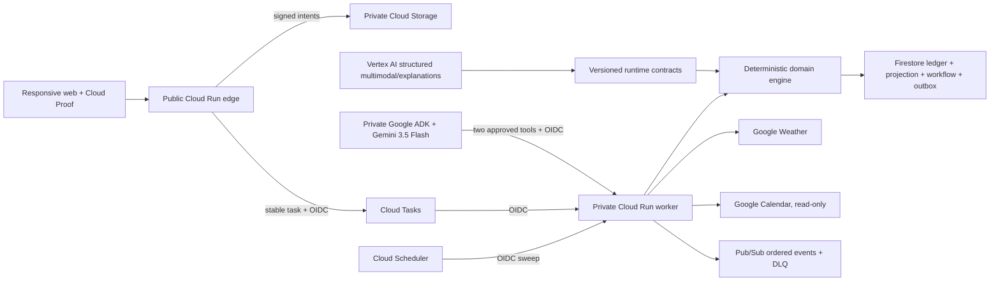

# Yange architecture

## Central idea

Yange maintains a live Wardrobe Digital Twin. The current view is reconstructed from an append-only event ledger, making decisions reproducible, observable, and safe to replay.

## Architectural laws

1. AI proposes; validated domain rules commit.
2. Every autonomous action is observable, reversible, and idempotent.
3. Long-running workflows resume from checkpoints.
4. Integration failures are isolated behind adapters.
5. New capabilities subscribe to domain events instead of rewriting the core.

## Local-to-cloud boundary

The domain owns no network or framework code. It exposes commands, events, projections, scores, and policies. Interfaces supply persistence, multimodal analysis, weather, calendar, notifications, and time.



Package ownership is explicit:

- `@yange/domain`: deterministic policies, commands, events, projections, simulation, and scores.
- `@yange/contracts`: versioned integration ports, runtime validation, and credential-free local adapters.
- `@yange/orchestrator`: checkpointed workflow sequencing, retry, resume, and duplicate-trigger handling.
- `@yange/web`: responsive presentation plus browser-backed repository implementations.
- `@yange/cloud`: Firestore, Storage, Tasks, Pub/Sub, Weather, Calendar, Vertex AI, configuration, and observability adapters.
- `@yange/api`: role-separated edge/worker HTTP boundary, session isolation, readiness, security headers, and static delivery.
- `services/yange_steward`: Google ADK reasoning service with narrow workload-identity tools.

## Implemented event flows

### Phase 1 — wear and confidence

```text
User marks outfit worn
        |
Command validates outfit state
        |
Deterministic wear policies emit garment transition events
        |
Event ledger persists atomically
        |
Projection replay updates availability and readiness
        |
Activity timeline renders the same committed evidence
        |
Confidence Check-in updates contextual preference memory
```

### Phase 2 — multimodal evidence intake

```text
User selects garment / care-label / inspiration image
        |
Browser validates extension + MIME + binary signature
        |
Decode -> orient -> resize -> WebP rewrite (metadata removed)
        |
IndexedDB stores Blob -------- ledger stores opaque asset ID only
        |
Versioned multimodal port -> deterministic local adapter
        |
Runtime contract parser rejects unsafe or malformed output
        |
User reviews and corrects field-level evidence
        |
Domain command validates provenance -> append-only event -> replayed twin
```

### Phase 3 — auditable outfit planning

```text
Manual weather port + manual calendar port
        |
Validated, timestamped planning-context snapshot
        |
Pure constraint generator rejects unavailable dependencies
        |
Five deterministic factors -> Personal Match receipt
        |
Explanation-only adapter describes the completed result
        |
User selects candidate -> validated idempotent command
        |
OutfitPlanned + dependency reservation events -> replayed twin
```

The model boundary is downstream of the decision. Runtime parsing rejects responses that contain garment selection, state changes, actions, events, or a replacement score. An explanation outage therefore degrades prose only; ranked candidates, factor evidence, and planning remain operational.

### Phase 3 — laundry safety graph

```text
Explicitly queued laundry garments
        |
Unknown / unreviewed care evidence -> fail-closed holdouts
        |
Confirmed care constraints -> incompatibility edges
        |
Stable graph colouring -> independent wash clusters
        |
Strictest bleach rule + per-garment drying routes
        |
Visible cluster evidence and separation trace
```

The clustering engine is pure TypeScript and deliberately conservative: extra loads are allowed; an incompatibility edge inside a recommended load is not.

### Phase 4 — autonomous WearCast

```text
Scheduler-shaped trigger with stable trigger ID
        |
Validated seven-day ForecastProvider snapshot
        |
Clone Digital Twin -> simulate Do nothing + Autopilot
        |
Risk policy -> drying opportunity -> verified fallback
        |
Validated idempotent domain commit
        |
Autonomy run + laundry windows + fallback + notification outbox events
        |
NotificationGateway delivery -> delivered events
```

The workflow stores six checkpoints in a repository independent of the event ledger. Forecast acquisition and branch simulation are read-only. The intervention commit is atomic at the local event-sink boundary. Notification delivery follows as its own checkpoint, so a gateway outage cannot erase or duplicate a valid wardrobe decision.

```text
triggered
   -> forecast-acquired
   -> decision-simulated
   -> interventions-committed
   -> notifications-delivered
   -> completed
```

Retry loads the existing execution and skips every reached checkpoint. A completed trigger replay returns the saved receipt and increments `duplicateTriggerCount`; it does not call the event sink or notification gateway. Per-notification checkpoint state and stable idempotency keys also protect partial delivery loops.

The browser implementation still uses `localStorage` for the free local product. In Google mode the same interfaces use Firestore plus a transactional outbox, so cloud execution did not require rewriting the workflow or domain engine.

### Phase 5 — production Google Cloud boundary

```text
public request -> edge validation/session -> stable Cloud Task
                                           |
                                           v
private worker -> read projection -> Google Weather -> WearCast policy
       |                                      |
       +-> Firestore transaction <------------+
              event + projection + outbox
                           |
                           v
                  Pub/Sub publish / retry sweep
```

The deployed Node container is role-shaped at runtime. The edge returns 404 for internal routes; the worker returns 404 for public routes. Cloud Run IAM is the primary internal authentication boundary, and the worker trusts `X-Yange-User` only after the platform has admitted the OIDC-authenticated caller. Stable Cloud Task names and workflow trigger IDs make duplicate transport delivery non-catastrophic.

The separate ADK service reasons with Gemini and can inspect or request a verified WearCast run. It has no Firestore or Storage dependency and cannot mutate state. Its worker calls carry Google-issued identity tokens; the worker independently revalidates every action.

Firestore stores four evidence surfaces under each opaque user partition: immutable events, a rebuildable current projection, checkpoint receipts, and outbox records. An append transaction either writes all matching evidence or none of it. Pub/Sub delivery is downstream, so transport failure cannot roll back a valid wardrobe decision.

### Replaceable model boundary

`@yange/contracts` owns the versioned multimodal and explanation requests, responses, runtime parsers, and adapter ports. The React experience depends on those boundaries rather than a Gemini SDK. Phase 5 can add Vertex AI adapters without changing domain commands, persisted events, scoring, or review UI.

### Local split persistence

- `localStorage`: the small append-only domain event ledger.
- `IndexedDB`: rewritten image blobs and media metadata.
- Domain events reference generated asset IDs and never carry pixels or original files.
- Reset clears both stores; a media-storage failure does not erase a successfully reset ledger.

## Reliability decisions

- Commands include operation IDs for idempotency.
- Invalid transitions emit nothing and return a domain error.
- Event projection is deterministic and can be rebuilt.
- External data is timestamped and carries freshness/confidence metadata.
- Model-produced structured data is versioned and validated before use.
- Confirmed user and care-label facts outrank AI estimates.
- Critical operations never depend on a WebGL or animation layer.
- Future simulation clones its inputs and cannot write the event ledger.
- Forecast heuristics express suitability and uncertainty, never a guaranteed drying completion time.
- Workflow retries are idempotent even when the underlying scheduler or message transport delivers more than once.
