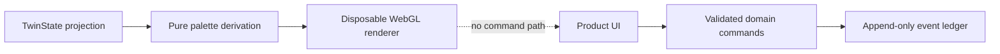

# Phase 6 specification — memorable, measurable, resilient

## Outcome

Phase 6 turns the production-shaped agent into a submission-ready experience. It adds a visual signature that is genuinely personal, a deterministic demo director, explicit failure proof, and a one-command verification path. It does not weaken the architectural law that AI proposes while validated domain rules commit.

## 1. Learned Style Aura

Style Aura is a one-way projection of the Wardrobe Digital Twin. It may read four evidence classes but cannot issue a command or write an event:

1. user-chosen preferred colours;
2. palettes from user-confirmed inspiration Look DNA;
3. positive colour signals learned from Confidence Check-ins; and
4. confirmed wardrobe colour fields, with user-added garments weighted above seed garments.

The palette derivation is deterministic. Human colour names and hexadecimal swatches resolve to a normalised colour value, close duplicates are collapsed, and the highest-weight diverse colourways become the four targets. A visible receipt shows the selected swatches, labels, source counts, personalisation stage, and evidence confidence. New evidence changes the shader target gradually rather than snapping the interface.

The WebGL implementation provides:

- a transparent fixed canvas behind all product content;
- five-octave FBM noise;
- three broad ribbons with separate vertical positions and drift rates;
- pointer, stylus, and touch inertia from normalised position, direction, velocity, and activity;
- local displacement, a trailing wake, and perpendicular curl;
- a circular buffer of 12 trail points added no more frequently than every 34 ms;
- alternating emerald, cyan, violet, and rose plume roles;
- soft Gaussian plumes with internal sinusoidal filaments;
- frame-rate-adjusted trail decay based on `0.988` per nominal frame;
- subtle procedural grain and scroll parallax;
- user-controlled energy and warmth plus view-specific emotional tone;
- device-pixel-ratio capped at 1.5 and automatic 0.74 render scaling under sustained frame pressure;
- requestAnimationFrame rendering, visibility pausing, and non-accumulating frame clears; and
- a frozen WebGL composition for `prefers-reduced-motion`.

The canvas uses approximately 0.68 CSS opacity and `mix-blend-mode: screen`. Foreground surfaces retain their own translucency and dark legibility veil. There is no video, stock background, permanent framebuffer accumulation, cursor-attached radial light, or animated CSS gradient.

## 2. Fault boundary

Style Aura is isolated from application function by construction:

Shader compilation failure, unavailable WebGL, a lost context, or the explicit Judge Mode failure switch replaces the canvas with a static, non-animated palette composition. Product controls remain mounted. A context restoration recreates GPU resources without refreshing or replaying product state.

## 3. Judge Mode

Judge Mode is available from navigation or directly at `/?mode=judge`. It is not a mock success screen. Six proof lights derive from current application state:

- private media evidence attached to a garment;
- confirmed inspiration Look DNA;
- an agent-planned outfit committed;
- Confidence Check-in memory;
- a detected WearCast capacity risk; and
- a completed checkpointed autonomy execution.

The page includes a five-act, four-minute runway with direct navigation to the surface required for each act. Its failure theatre demonstrates that Style Aura can fail while wardrobe readiness and state remain intact. The Aura receipt shows exactly why the current user sees their current colours.

## 4. Honest demo contract

- Local mode is a deterministic, credential-free rehearsal using the same versioned ports as production.
- The weather fixture is visibly labelled as a manual Kampala forecast.
- Social-video inspiration means a user-selected saved frame; Yange does not claim free or reliable TikTok URL ingestion.
- Drying output is a suitability window, not a promise that a garment will be dry at an exact time.
- Personal Match is deterministic evidence, not an attractiveness score.
- The Cloud Proof card may say Google live only when runtime evidence reports Google mode.

## 5. Exit gates

Phase 6 is complete only when:

- palette unit tests, the whole workspace test suite, strict typechecks, and production builds pass;
- renderer loss leaves state, readiness, navigation, and commands working;
- no console error appears during the judged path;
- 390 px phone and desktop layouts have no page-level horizontal overflow;
- reduced-motion produces a frozen composition;
- a fresh clone can follow README commands without source edits; and
- the final cloud take captures a live revision, checkpoint receipt, trace identifier, and Google-mode runtime card.

